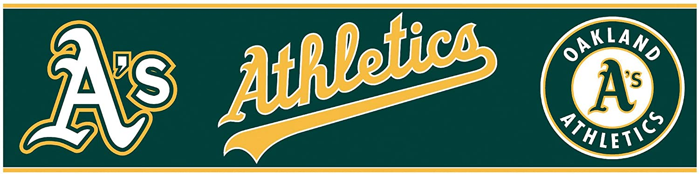
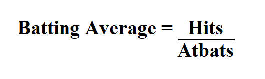
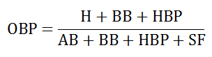
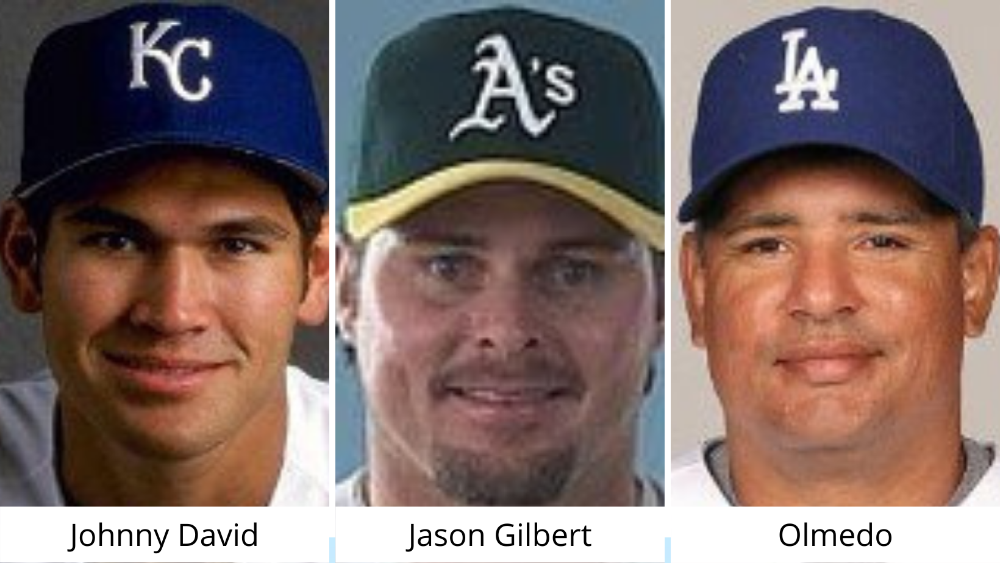

# Quando a análise estatística mudou o rumo de um campeonato!

{width="557"}

Este projeto foi desenvolvido durante o curso Data Science and Machine Learning Bootcamp with R com o professor Jose Portilla. O intuito deste trabalho é analisar a base de dados da Major League Baseball de 1871 à 2013 e tomar as melhores decisões baseadas em métodos estatísticos.

### Breve contexto - Major League Baseball 2002

Quando pensamos em 2002 lembramos rapidamente do nosso pentacampeonato com a camisa amarelinha. Porém, este ano ficou marcado, também, para o Oakland Athletics como uma das maiores temporadas na MLB do time. No período de pré-temporada, o grupo acabou perdendo as três peças principais do seu elenco para equipes de maior poder aquisitivo. Dessa forma, a equipe liderada por Billy Beane, gerente geral, teve que se reinventar e buscar alternativas para reposição dos jogadores e criação de um grupo competitivo apesar do baixo orçamento do time. Billy teve uma ideia simples: utilizar estatísticas com o intuito de achar padrões no esporte, às quais quase nenhum olheiro, na época, prestava atenção. Com base na combinação de métodos estatísticos e gestão esportiva, o Oakland Athletics alcançou a marca de 103 vitórias na temporada, sendo campeão da Divisão Oeste Americana e o trabalho de Billy serviu de exemplo para os demais clubes. Agora, finalmente, você irá retornar comigo para o ano de 2002 e juntos assumiremos o papel de gerente geral da equipe com o objetivo de contratar os melhores jogadores disponíveis no mercado para repor as peças que saíram na pré-temporada, de acordo com o contexto econômico do time no período. Durante o desenvolvimento do projeto irei explicar um pouco mais sobre as estatísticas utilizadas. Vamos colocar a mão na massa e começar carregando os pacotes e datasets necessários para o desenvolvimento do trabalho.

```{r}
#Pacotes
library(dplyr)
library(ggplot2)
#DataSets
rebatedor <- read.csv("Batting.csv")
salarios <- read.csv("Salaries.csv")
guia_nomes <- read.csv("Master.csv")
```

### Conhecendo o DataSet

Primeiramente, começaremos nosso projeto utilizando o dataset "rebatedor" que irá nos fornecer os dados de todos os rebatedores da MLB de 1871 à 2013. Dessa forma, para conhecer nossos dados, vamos visualizar as últimas 5 linhas do dataset.

```{r}
tail(rebatedor, 5)
```

Podemos observar que temos diversas informações no conjunto de dados, como: "playerID" (código para identificação dos jogadores), "yearID" (ano da temporada dos jogadores), "teamID" (código para identificação dos clubes) etc. No Beisebol são usadas diversas abreviações para indicar diferentes estatísticas utilizadas para analisar o desempenho de um jogador. Para construir nosso modelo vamos precisar analisar algumas colunas e construir novas métricas de aproveitamento.

### Construindo a AVG - BATTING AVERAGE

{width="213"}

Para analisar o desempenho do rebatedor, vamos construir a AVG para medir o número total de rebatidas válidas em relação à quantidade de vezes que o atleta se posiciona para rebater. Vamos criar uma nova coluna chamada "AVG" que será resultado da divisão da coluna "H" (rebatidas válidas) pela "AB" (oportunidades no bastão). Essa métrica irá mostrar o melhor aproveitamento no bastão.

```{r}
#Fórmula AVG
rebatedor$AVG <- rebatedor$H/rebatedor$AB 
```

Agora, vamos checar as últimas 5 linhas da nova coluna "AVG".

```{r}
tail(rebatedor$AVG, 5)
```

### Construindo a OBP - ON BASE PERCENTAGE

{width="213" height="64"}

A AVG sozinha não consegue fornecer uma métrica consistente para avaliar o desempenho de um rebatedor, pois desconsidera algumas estatísticas importantes e que muda o rumo de uma partida, como o "BB" (quando o arremessador avança para a primeira base). Dessa forma, também, construiremos a OBP para demonstrar a porcentagem que o jogador consegue chegar na base. Vamos criar, novamente, uma nova coluna chamada "OBP" que será resultado da soma das colunas "H" (rebatidas válidas), "BB" (quando o arremessador avança para a primeira base), "HBP" (acerto no rebatedor adversário), dividido por "AB" (oportunidades no bastão), "BB" (quando o arremessador avança para a primeira base), "HBP" (acerto no rebatedor adversário), "SF" (sacrifício). Esta estatística exclui os erros e fornece a real habilidade do jogador de chegar em base.

```{r}
#Fórmula OBP
rebatedor$OBP <- (rebatedor$H + rebatedor$BB + rebatedor$HBP)/(rebatedor$AB + rebatedor$BB + rebatedor$HBP + rebatedor$SF)
```

As últimas 5 linhas da coluna "OBP".

```{r}
tail(rebatedor$OBP,5)
```

Com essas duas métricas podemos avaliar o aproveitamento nas duas características primordiais para um grande rebatedor.

### Analisando o dataset rebatedor e salários

Vamos utilizar mais um dataset "salarios", adicionado anteriormente, e analisaremos os índices das bases de dados.

```{r}
summary(rebatedor)
```

O índice do dataset "salarios".

```{r}
summary(salarios)
```

Repare que no dataset "rebatedor" na coluna "yearID" temos dados de 1871 até 2013 e no dataset "salarios" na mesma coluna - "yearID" - apenas a partir de 1985. Dessa forma, iremos filtrar o "rebatedor" a partir do ano 1985 para igualar com os dados fornecidos pelo dataset "salarios". Posteriormente, iremos unir os dois datasets criando uma nova base de dados denominada "rebatedor_filtrado".

```{r}
rebatedor <- subset(rebatedor, yearID >= 1985) #Filtragem 
rebatedor_filtrado <- merge(rebatedor,salarios, by = c("playerID", "yearID")) #Junção
```

### Identificando ID dos jogadores

Os três principais jogadores que foram vendidos na pré-temporada tem os seguintes códigos de identificação - "giambja01", "damonjo01", "saenzol01". Porém, queremos descobrir qual é o verdadeiro nome desses jogadores. Dessa forma, vamos utilizar o dataset "guia_nomes" e filtrar pela coluna "playerID".

```{r}
guia_nomes %>% filter(playerID %in% c("giambja01","damonjo01","saenzol01"))
```

{width="447" height="200"}

Utilizaremos nosso dataset "rebatedor_filtrado" para selecionar as informações dos jogadores que saíram da equipe, com intuito de comparar com os possíveis atletas que iremos contratar. Não podemos esquecer de selecionar apenas a temporada em que os jogadores atuaram pelo Oakland Athletics, ou seja, o ano de 2001.

```{r}
antigos_jogadores <- subset(rebatedor_filtrado,playerID %in% c('giambja01','damonjo01','saenzol01'))
antigos_jogadores <- subset(antigos_jogadores, yearID == 2001)
head(antigos_jogadores)
```

Agora temos os dados filtrados e atribuídos a um novo dataset chamado "antigos_jogadores". Dessa forma, podemos reduzir o quadro de dados e selecionar apenas as colunas que iremos usar como métrica de avaliação ("playerID", "AB", "AVG", "OBP", "salary").

```{r}
antigos_jogadores <- select(antigos_jogadores,playerID,AB,AVG,OBP,salary) #Reduzindo base de dados
head(antigos_jogadores)
```

### Classificando por ano, salário e AVG

Finalmente chegou a hora de selecionarmos os atletas para a temporada de 2002. Para realizar a contratação, a equipe financeira do Oakland Athletics determinou que o salário de cada jogador não pode ser superior a 8 milhões de dólares por ano. Somado a isso, no intuito de manter um time competitivo, devemos procurar jogadores que tenham a AVG pelo menos igual a do atleta Olmedo (menor AVG) e a AB de cada jogador maior ou igual a 500, pois a soma da AB dos três ex-atletas da Oakland era de 1.469.

```{r}
avaliação_jogadores <- filter(rebatedor_filtrado,yearID==2001, salary<8000000, AVG>=0.2196721, AB>=500) #Filtrando por ano, salário e AVG
ggplot(avaliação_jogadores, aes(x=OBP,y=salary)) + geom_point(aes(color = AVG))
```

O gráfico de dispersão é uma ótima ferramenta para analisar o relacionamento entre duas variáveis de dados. Nesse caso, devido ao número relativamente pequeno de dados foi possível utilizar este gráfico, porém para uma análise de um conjunto de milhares de dados, o gráfico de dispersão seria muito denso, sendo aconselhável utilizar um modo diferente de visualização de dados. Em suma, podemos reparar que cada ponto no gráfico é um registro, desse modo, os atletas mais interessantes para nossa equipe são os jogadores que mais se aproximam à direita do eixo OBP (menores salários e maior OBP) e com os pontos mais claros no mapa (maior AVG).

### Classificando por OBP

Vamos reorganizar o nosso dataset "avaliação_jogadores" em ordem decrescente da OBP, selecionando apenas as colunas que interessam para análise. Selecionaremos apenas os 10 primeiros com maior OBP.

```{r}
possiveis <- head(arrange(avaliação_jogadores,desc(OBP)),10)
possiveis <- select(possiveis,playerID,OBP,AVG,AB,salary)
possiveis
```

Observe que o primeiro jogador "giambja01" é o atleta que saiu da equipe, portanto, não podemos contratá-lo novamente. Neste sentido, os atletas selecionados são "heltoto01", "berkmla01", "gonzalu01".

### Selecionando os jogadores

```{r}
jogadores_escolhidos <- possiveis[2:4,]
jogadores_escolhidos
```

Todos os jogadores possuem a AVG maior que a menor AVG do atleta Olmedo que saiu da equipe, possuem, também, OBP dentro do padrão necessário para a contratação e salários abaixo do teto estipulado para a equipe. Dessa forma, vamos identificar pelo "playerID" o verdadeiro nome dos atletas que irão defender a camisa do Oakland Athletics em 2002.

```{r}
guia_nomes %>% filter(playerID %in% c("heltoto01","berkmla01","gonzalu01"))
```

{width="447" height="200"}

Chegamos ao final dessa missão com os nomes dos melhores jogadores para defender a camisa do time para a temporada de 2002. Conseguimos observar durante essa pesquisa que a estatística pode, de fato, ser uma ferramenta de extrema utilidade para tomadas de decisão. Agora, imagine a quantidade de dinheiro que ganharíamos se realmente pudéssemos voltar ao passado com nossos notebooks e resolver um tanto de problemas reais das equipes de beisebol americanas.
