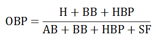

# MoneyBall - Análise Quantitativa

# Quando a análise estatística mudou o rumo de um campeonato!

 

Este projeto foi desenvolvido durante o curso Data Science and Machine
Learning Bootcamp with R com o professor Jose Portilla. O intuito deste
trabalho é analisar a base de dados da Major League Baseball de 1871 à
2013 e tomar as melhores decisões baseadas em métodos estatísticos.

### Breve contexto - Major League Baseball 2002

Quando pensamos em 2002 lembramos rapidamente do nosso pentacampeonato
com a camisa amarelinha. Porém, este ano ficou marcado, também, para o
Oakland Athletics como uma das maiores temporadas na MLB do time. No
período de pré-temporada, o grupo acabou perdendo as três peças
principais do seu elenco para equipes de maior poder aquisitivo. Dessa
forma, a equipe liderada por Billy Beane, gerente geral, teve que se
reinventar e buscar alternativas para reposição dos jogadores e criação
de um grupo competitivo apesar do baixo orçamento do time. Billy teve
uma ideia simples: utilizar estatísticas com o intuito de achar padrões
no esporte, às quais quase nenhum olheiro, na época, prestava atenção.
Com base na combinação de métodos estatísticos e gestão esportiva, o
Oakland Athletics alcançou a marca de 103 vitórias na temporada, sendo
campeão da Divisão Oeste Americana e o trabalho de Billy serviu de
exemplo para os demais clubes. Agora, finalmente, você irá retornar
comigo para o ano de 2002 e juntos assumiremos o papel de gerente geral
da equipe com o objetivo de contratar os melhores jogadores disponíveis
no mercado para repor as peças que saíram na pré-temporada, de acordo
com o contexto econômico do time no período. Durante o desenvolvimento
do projeto irei explicar um pouco mais sobre as estatísticas utilizadas.
Vamos colocar a mão na massa e começar carregando os pacotes e datasets
necessários para o desenvolvimento do trabalho.

``` r
#Pacotes
library(dplyr)
library(ggplot2)
#DataSets
rebatedor <- read.csv("Batting.csv")
salarios <- read.csv("Salaries.csv")
guia_nomes <- read.csv("Master.csv")
```

### Conhecendo o DataSet

Primeiramente, começaremos nosso projeto utilizando o dataset
"rebatedor" que irá nos fornecer os dados de todos os rebatedores da MLB
de 1871 à 2013. Dessa forma, para conhecer nossos dados, vamos
visualizar as últimas 5 linhas do dataset.

``` r
tail(rebatedor, 5)
```

    ##        playerID yearID stint teamID lgID   G G_batting  AB  R   H X2B X3B HR
    ## 97885 zimmejo02   2013     1    WAS   NL  32        32  65  4   8   1   0  0
    ## 97886 zimmery01   2013     1    WAS   NL 147       147 568 84 156  26   2 26
    ## 97887  zitoba01   2013     1    SFN   NL  30        30  34  3   5   0   0  0
    ## 97888 zobribe01   2013     1    TBA   AL 157       157 612 77 168  36   3 12
    ## 97889 zuninmi01   2013     1    SEA   AL  52        52 173 22  37   5   0  5
    ##       RBI SB CS BB  SO IBB HBP SH SF GIDP G_old
    ## 97885   2  0  0  1  20   0   0  6  1    0    NA
    ## 97886  79  6  0 60 133   2   2  0  3   16    NA
    ## 97887   2  0  0  0   8   0   0  9  0    1    NA
    ## 97888  71 11  3 72  91   4   7  1  6   18    NA
    ## 97889  14  1  0 16  49   0   3  0  1    5    NA

Podemos observar que temos diversas informações no conjunto de dados,
como: "playerID" (código para identificação dos jogadores), "yearID"
(ano da temporada dos jogadores), "teamID" (código para identificação
dos clubes) etc. No Beisebol são usadas diversas abreviações para
indicar diferentes estatísticas utilizadas para analisar o desempenho de
um jogador. Para construir nosso modelo vamos precisar analisar algumas
colunas e construir novas métricas de aproveitamento.

### Construindo a AVG - BATTING AVERAGE


Para analisar o desempenho do rebatedor, vamos construir a AVG para
medir o número total de rebatidas válidas em relação à quantidade de
vezes que o atleta se posiciona para rebater. Vamos criar uma nova
coluna chamada "AVG" que será resultado da divisão da coluna "H"
(rebatidas válidas) pela "AB" (oportunidades no bastão). Essa métrica
irá mostrar o melhor aproveitamento no bastão.

``` r
#Fórmula AVG
rebatedor$AVG <- rebatedor$H/rebatedor$AB 
```

Agora, vamos checar as últimas 5 linhas da nova coluna "AVG".

``` r
tail(rebatedor$AVG, 5)
```

    ## [1] 0.1230769 0.2746479 0.1470588 0.2745098 0.2138728

### Construindo a OBP - ON BASE PERCENTAGE



A AVG sozinha não consegue fornecer uma métrica consistente para avaliar
o desempenho de um rebatedor, pois desconsidera algumas estatísticas
importantes e que muda o rumo de uma partida, como o "BB" (quando o
arremessador avança para a primeira base). Dessa forma, também,
construiremos a OBP para demonstrar a porcentagem que o jogador consegue
chegar na base. Vamos criar, novamente, uma nova coluna chamada "OBP"
que será resultado da soma das colunas "H" (rebatidas válidas), "BB"
(quando o arremessador avança para a primeira base), "HBP" (acerto no
rebatedor adversário), dividido por "AB" (oportunidades no bastão), "BB"
(quando o arremessador avança para a primeira base), "HBP" (acerto no
rebatedor adversário), "SF" (sacrifício). Esta estatística exclui os
erros e fornece a real habilidade do jogador de chegar em base.

``` r
#Fórmula OBP
rebatedor$OBP <- (rebatedor$H + rebatedor$BB + rebatedor$HBP)/(rebatedor$AB + rebatedor$BB + rebatedor$HBP + rebatedor$SF)
```

As últimas 5 linhas da coluna "OBP".

``` r
tail(rebatedor$OBP,5)
```

    ## [1] 0.1343284 0.3443918 0.1470588 0.3543759 0.2901554

Com essas duas métricas podemos avaliar o aproveitamento nas duas
características primordiais para um grande rebatedor.

### Analisando o dataset rebatedor e salários

Vamos utilizar mais um dataset "salarios", adicionado anteriormente, e
analisaremos os índices das bases de dados.

``` r
summary(rebatedor)
```

    ##    playerID             yearID         stint          teamID         
    ##  Length:97889       Min.   :1871   Min.   :1.000   Length:97889      
    ##  Class :character   1st Qu.:1931   1st Qu.:1.000   Class :character  
    ##  Mode  :character   Median :1970   Median :1.000   Mode  :character  
    ##                     Mean   :1962   Mean   :1.077                     
    ##                     3rd Qu.:1995   3rd Qu.:1.000                     
    ##                     Max.   :2013   Max.   :5.000                     
    ##                                                                      
    ##      lgID                 G            G_batting            AB       
    ##  Length:97889       Min.   :  1.00   Min.   :  0.00   Min.   :  0.0  
    ##  Class :character   1st Qu.: 13.00   1st Qu.:  7.00   1st Qu.:  9.0  
    ##  Mode  :character   Median : 35.00   Median : 32.00   Median : 61.0  
    ##                     Mean   : 51.65   Mean   : 49.13   Mean   :154.1  
    ##                     3rd Qu.: 81.00   3rd Qu.: 81.00   3rd Qu.:260.0  
    ##                     Max.   :165.00   Max.   :165.00   Max.   :716.0  
    ##                                      NA's   :1406     NA's   :6413   
    ##        R                H               X2B            X3B        
    ##  Min.   :  0.00   Min.   :  0.00   Min.   : 0.0   Min.   : 0.000  
    ##  1st Qu.:  0.00   1st Qu.:  1.00   1st Qu.: 0.0   1st Qu.: 0.000  
    ##  Median :  5.00   Median : 12.00   Median : 2.0   Median : 0.000  
    ##  Mean   : 20.47   Mean   : 40.37   Mean   : 6.8   Mean   : 1.424  
    ##  3rd Qu.: 31.00   3rd Qu.: 66.00   3rd Qu.:10.0   3rd Qu.: 2.000  
    ##  Max.   :192.00   Max.   :262.00   Max.   :67.0   Max.   :36.000  
    ##  NA's   :6413     NA's   :6413     NA's   :6413   NA's   :6413    
    ##        HR              RBI               SB                CS        
    ##  Min.   : 0.000   Min.   :  0.00   Min.   :  0.000   Min.   : 0.000  
    ##  1st Qu.: 0.000   1st Qu.:  0.00   1st Qu.:  0.000   1st Qu.: 0.000  
    ##  Median : 0.000   Median :  5.00   Median :  0.000   Median : 0.000  
    ##  Mean   : 3.002   Mean   : 18.47   Mean   :  3.265   Mean   : 1.385  
    ##  3rd Qu.: 3.000   3rd Qu.: 28.00   3rd Qu.:  2.000   3rd Qu.: 1.000  
    ##  Max.   :73.000   Max.   :191.00   Max.   :138.000   Max.   :42.000  
    ##  NA's   :6413     NA's   :6837     NA's   :7713      NA's   :29867   
    ##        BB               SO              IBB              HBP        
    ##  Min.   :  0.00   Min.   :  0.00   Min.   :  0.00   Min.   : 0.000  
    ##  1st Qu.:  0.00   1st Qu.:  2.00   1st Qu.:  0.00   1st Qu.: 0.000  
    ##  Median :  4.00   Median : 11.00   Median :  0.00   Median : 0.000  
    ##  Mean   : 14.21   Mean   : 21.95   Mean   :  1.28   Mean   : 1.136  
    ##  3rd Qu.: 21.00   3rd Qu.: 31.00   3rd Qu.:  1.00   3rd Qu.: 1.000  
    ##  Max.   :232.00   Max.   :223.00   Max.   :120.00   Max.   :51.000  
    ##  NA's   :6413     NA's   :14251    NA's   :42977    NA's   :9233    
    ##        SH               SF             GIDP           G_old       
    ##  Min.   : 0.000   Min.   : 0.0    Min.   : 0.00   Min.   :  0.00  
    ##  1st Qu.: 0.000   1st Qu.: 0.0    1st Qu.: 0.00   1st Qu.: 11.00  
    ##  Median : 1.000   Median : 0.0    Median : 1.00   Median : 34.00  
    ##  Mean   : 2.564   Mean   : 1.2    Mean   : 3.33   Mean   : 50.99  
    ##  3rd Qu.: 3.000   3rd Qu.: 2.0    3rd Qu.: 5.00   3rd Qu.: 82.00  
    ##  Max.   :67.000   Max.   :19.0    Max.   :36.00   Max.   :165.00  
    ##  NA's   :12751    NA's   :42446   NA's   :32521   NA's   :5189    
    ##       AVG             OBP       
    ##  Min.   :0.000   Min.   :0.00   
    ##  1st Qu.:0.148   1st Qu.:0.19   
    ##  Median :0.231   Median :0.29   
    ##  Mean   :0.209   Mean   :0.26   
    ##  3rd Qu.:0.275   3rd Qu.:0.34   
    ##  Max.   :1.000   Max.   :1.00   
    ##  NA's   :13520   NA's   :49115

O índice do dataset "salarios".

``` r
summary(salarios)
```

    ##      yearID        teamID              lgID             playerID        
    ##  Min.   :1985   Length:23956       Length:23956       Length:23956      
    ##  1st Qu.:1993   Class :character   Class :character   Class :character  
    ##  Median :1999   Mode  :character   Mode  :character   Mode  :character  
    ##  Mean   :1999                                                           
    ##  3rd Qu.:2006                                                           
    ##  Max.   :2013                                                           
    ##      salary        
    ##  Min.   :       0  
    ##  1st Qu.:  250000  
    ##  Median :  507950  
    ##  Mean   : 1864357  
    ##  3rd Qu.: 2100000  
    ##  Max.   :33000000

Repare que no dataset "rebatedor" na coluna "yearID" temos dados de 1871
até 2013 e no dataset "salarios" na mesma coluna - "yearID" - apenas a
partir de 1985. Dessa forma, iremos filtrar o "rebatedor" a partir do
ano 1985 para igualar com os dados fornecidos pelo dataset "salarios".
Posteriormente, iremos unir os dois datasets criando uma nova base de
dados denominada "rebatedor_filtrado".

``` r
rebatedor <- subset(rebatedor, yearID >= 1985) #Filtragem 
rebatedor_filtrado <- merge(rebatedor,salarios, by = c("playerID", "yearID")) #Junção
```

### Identificando ID dos jogadores

Os três principais jogadores que foram vendidos na pré-temporada tem os
seguintes códigos de identificação - "giambja01", "damonjo01",
"saenzol01". Porém, queremos descobrir qual é o verdadeiro nome desses
jogadores. Dessa forma, vamos utilizar o dataset "guia_nomes" e filtrar
pela coluna "playerID".

``` r
guia_nomes %>% filter(playerID %in% c("giambja01","damonjo01","saenzol01"))
```

    ##    playerID     nameGiven
    ## 1 damonjo01  Johnny David
    ## 2 giambja01 Jason Gilbert
    ## 3 saenzol01        Olmedo


Utilizaremos nosso dataset "rebatedor_filtrado" para selecionar as
informações dos jogadores que saíram da equipe, com intuito de comparar
com os possíveis atletas que iremos contratar. Não podemos esquecer de
selecionar apenas a temporada em que os jogadores atuaram pelo Oakland
Athletics, ou seja, o ano de 2001.

``` r
antigos_jogadores <- subset(rebatedor_filtrado,playerID %in% c('giambja01','damonjo01','saenzol01'))
antigos_jogadores <- subset(antigos_jogadores, yearID == 2001)
head(antigos_jogadores)
```

    ##        playerID yearID stint teamID.x lgID.x   G G_batting  AB   R   H X2B X3B
    ## 5141  damonjo01   2001     1      OAK     AL 155       155 644 108 165  34   4
    ## 7878  giambja01   2001     1      OAK     AL 154       154 520 109 178  47   2
    ## 20114 saenzol01   2001     1      OAK     AL 106       106 305  33  67  21   1
    ##       HR RBI SB CS  BB SO IBB HBP SH SF GIDP G_old       AVG       OBP teamID.y
    ## 5141   9  49 27 12  61 70   1   5  5  4    7   155 0.2562112 0.3235294      OAK
    ## 7878  38 120  2  0 129 83  24  13  0  9   17   154 0.3423077 0.4769001      OAK
    ## 20114  9  32  0  1  19 64   1  13  1  3    9   106 0.2196721 0.2911765      OAK
    ##       lgID.y  salary
    ## 5141      AL 7100000
    ## 7878      AL 4103333
    ## 20114     AL  290000

Agora temos os dados filtrados e atribuídos a um novo dataset chamado
"antigos_jogadores". Dessa forma, podemos reduzir o quadro de dados e
selecionar apenas as colunas que iremos usar como métrica de avaliação
("playerID", "AB", "AVG", "OBP", "salary").

``` r
antigos_jogadores <- select(antigos_jogadores,playerID,AB,AVG,OBP,salary) #Reduzindo base de dados
head(antigos_jogadores)
```

    ##        playerID  AB       AVG       OBP  salary
    ## 5141  damonjo01 644 0.2562112 0.3235294 7100000
    ## 7878  giambja01 520 0.3423077 0.4769001 4103333
    ## 20114 saenzol01 305 0.2196721 0.2911765  290000

### Classificando por ano, salário e AVG

Finalmente chegou a hora de selecionarmos os atletas para a temporada de
2002. Para realizar a contratação, a equipe financeira do Oakland
Athletics determinou que o salário de cada jogador não pode ser superior
a 8 milhões de dólares por ano. Somado a isso, no intuito de manter um
time competitivo, devemos procurar jogadores que tenham a AVG pelo menos
igual a do atleta Olmedo (menor AVG) e a AB de cada jogador maior ou
igual a 500, pois a soma da AB dos três ex-atletas da Oakland era de
1.469.

``` r
avaliação_jogadores <- filter(rebatedor_filtrado,yearID==2001, salary<8000000, AVG>=0.2196721, AB>=500) #Filtrando por ano, salário e AVG
ggplot(avaliação_jogadores, aes(x=OBP,y=salary)) + geom_point(aes(color = AVG))
```

<!-- -->

O gráfico de dispersão é uma ótima ferramenta para analisar o
relacionamento entre duas variáveis de dados. Nesse caso, devido ao
número relativamente pequeno de dados foi possível utilizar este
gráfico, porém para uma análise de um conjunto de milhares de dados, o
gráfico de dispersão seria muito denso, sendo aconselhável utilizar um
modo diferente de visualização de dados. Em suma, podemos reparar que
cada ponto no gráfico é um registro, desse modo, os atletas mais
interessantes para nossa equipe são os jogadores que mais se aproximam à
direita do eixo OBP (menores salários e maior OBP) e com os pontos mais
claros no mapa (maior AVG).

### Classificando por OBP

Vamos reorganizar o nosso dataset "avaliação_jogadores" em ordem
decrescente da OBP, selecionando apenas as colunas que interessam para
análise. Selecionaremos apenas os 10 primeiros com maior OBP.

``` r
possiveis <- head(arrange(avaliação_jogadores,desc(OBP)),10)
possiveis <- select(possiveis,playerID,OBP,AVG,AB,salary)
possiveis
```

    ##     playerID       OBP       AVG  AB  salary
    ## 1  giambja01 0.4769001 0.3423077 520 4103333
    ## 2  heltoto01 0.4316547 0.3356048 587 4950000
    ## 3  berkmla01 0.4302326 0.3310225 577  305000
    ## 4  gonzalu01 0.4285714 0.3251232 609 4833333
    ## 5  thomeji01 0.4161491 0.2908745 526 7875000
    ## 6  alomaro01 0.4146707 0.3356522 575 7750000
    ## 7  edmonji01 0.4102142 0.3040000 500 6333333
    ## 8  gilesbr02 0.4035608 0.3090278 576 7333333
    ## 9  pujolal01 0.4029630 0.3288136 590  200000
    ## 10 olerujo01 0.4011799 0.3024476 572 6700000

Observe que o primeiro jogador "giambja01" é o atleta que saiu da
equipe, portanto, não podemos contratá-lo novamente. Neste sentido, os
atletas selecionados são "heltoto01", "berkmla01", "gonzalu01".

### Selecionando os jogadores

``` r
jogadores_escolhidos <- possiveis[2:4,]
jogadores_escolhidos
```

    ##    playerID       OBP       AVG  AB  salary
    ## 2 heltoto01 0.4316547 0.3356048 587 4950000
    ## 3 berkmla01 0.4302326 0.3310225 577  305000
    ## 4 gonzalu01 0.4285714 0.3251232 609 4833333

Todos os jogadores possuem a AVG maior que a menor AVG do atleta Olmedo
que saiu da equipe, possuem, também, OBP dentro do padrão necessário
para a contratação e salários abaixo do teto estipulado para a equipe.
Dessa forma, vamos identificar pelo "playerID" o verdadeiro nome dos
atletas que irão defender a camisa do Oakland Athletics em 2002.

``` r
guia_nomes %>% filter(playerID %in% c("heltoto01","berkmla01","gonzalu01"))
```

    ##    playerID     nameGiven
    ## 1 berkmla01 William Lance
    ## 2 gonzalu01   Luis Emilio
    ## 3 heltoto01     Todd Lynn


Chegamos ao final dessa missão com os nomes dos melhores jogadores para
defender a camisa do time para a temporada de 2002. Conseguimos observar
durante essa pesquisa que a estatística pode, de fato, ser uma
ferramenta de extrema utilidade para tomadas de decisão. Agora, imagine
a quantidade de dinheiro que ganharíamos se realmente pudéssemos voltar
ao passado com nossos notebooks e resolver um tanto de problemas reais
das equipes de beisebol americanas.
